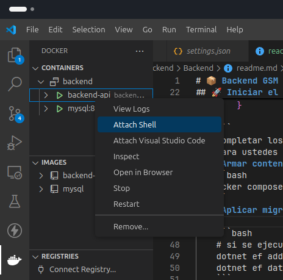

# 📦 Backend VocacionPlus - Proyecto Web API con MySQL y Docker

Este proyecto es un backend en ASP.NET Core Web API utilizando Entity Framework Core y MySQL como base de datos. Está preparado para funcionar tanto en local como dentro de contenedores Docker.

---

## 📁 Requisitos

- [.NET SDK 8.0](https://dotnet.microsoft.com/download/dotnet/8.0)
- [Docker](https://www.docker.com/)
- [MySQL](https://www.mysql.com/downloads/) (opcional si no se usa Docker para la DB)

---

## 💻 Instalar Dependencias (linux)

**Docker y dotnet**
```bash
sudo apt install docker
sudo apt install dotnet-8
dotnet tool install --global dotnet-ef
```
## 🚀 Iniciar el entorno con Docker

1. **Clonar el repositorio**:
   ```bash
   git clone https://github.com/mariano-gabriel-martinez164/VocacionPlus.git
   cd Backend/Backend
   ```
2. **crear password.cs**
    ```cs
    namespace VocacionPlus.DB
    {
        public class DB_User
        {
            static public string UserName = "";
            static public string Password = "";
        }
    }
    ```
    completar los campos y guardar los cambios este archivo solo es visible para ustedes no se sube al repo. para UserName por ahora usen "root".
3. **Armar contenedores**:
   ```bash
   docker compose up --build
   ```
4. **Aplicar migraciones**

    abrir terminal del backend del docker

    
    ```bash
    # si se ejecuta fuera del docker los cambios van a la DB local
    dotnet ef database update 
    ```
5. **Desplegar API**
    
    abrir [API](http://localhost:5000/) en la web

# Pasos extras

## 🧩 Migraciones de EF Core
**Crear una nueva migracion**
```bash
dotnet ef migrations add NombreMigracion    #crea migracion
dotnet ef database update                   #actualiza DB
```
**Migraciones en docker desde shell local**
```bash
export ASPNETCORE_ENVIRONMENT=Docker
dotnet ef migrations add NombreMigracion    #crea migracion
dotnet ef database update                   #actualiza DB
```

**Cerrar docker**
```bash
docker compose down
```

descargar la extension de docker para vscode

