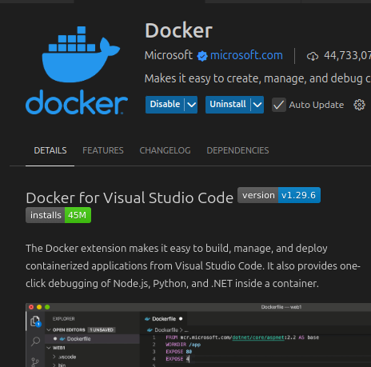

# 📦 Backend VocacionPlus - Proyecto Web API con MySQL y Docker

Este proyecto es un backend en ASP.NET Core Web API utilizando Entity Framework Core y MySQL como base de datos. Está preparado para funcionar tanto en local como dentro de contenedores Docker.

---

## 📁 Requisitos

- [.NET SDK 8.0](https://dotnet.microsoft.com/download/dotnet/8.0)
- [Docker](https://www.docker.com/)
- [MySQL](https://www.mysql.com/downloads/) (opcional si no se usa Docker para la DB)

---

## 💻 Instalar Dependencias (linux)

**Docker, dotnet y mysql**
```bash
# instalar docker
sudo apt install ca-certificates curl gnupg lsb-release -y
sudo mkdir -p /etc/apt/keyrings
curl -fsSL https://download.docker.com/linux/debian/gpg | sudo gpg --dearmor -o /etc/apt/keyrings/docker.gpg
echo \
  "deb [arch=$(dpkg --print-architecture) signed-by=/etc/apt/keyrings/docker.gpg] \
  https://download.docker.com/linux/debian \
  $(lsb_release -cs) stable" | \
  sudo tee /etc/apt/sources.list.d/docker.list > /dev/null
sudo apt update
sudo apt install docker-ce docker-ce-cli containerd.io docker-buildx-plugin docker-compose-plugin -y
sudo usermod -aG docker $USER
newgrp docker
# instalar dotnet
sudo apt install dotnet-sdk-8.0
dotnet tool install --global dotnet-ef
# instalar mysql
sudo apt install mysql-server
sudo mysql
ALTER USER 'root'@'localhost' IDENTIFIED WITH mysql_native_password BY 'contraseña';
```
usar la misma contraseña del ultimo comando para el paso 2 en Iniciar elentorno
## 🚀 Iniciar el entorno

1. **Clonar el repositorio**:
   ```bash
   git clone https://github.com/mariano-gabriel-martinez164/VocacionPlus.git
   cd Backend/Backend
   ```
2. **Variable de entorno**
    ``` bash
    export ASPNETCORE_ENVIRONMENT=Docker # Development Server
    ```
    la usamos para trabajar sobre la base de datos de docker o la local (Development) o una base de datos externa (Server).
3. **Crear usuario DB**:
    
    completar docker-compose.yml con .env
                
        DB_PASSWORD=contraseña
    crear appsettings.User.json con
    
        {
            "ConnectionStrings": {
                "Username": "usuario",
                "Password": "contraeña"
            }
        }

    usen root como usuario

4. **Correr API**:
   ```bash
   # Docker
   export ASPNETCORE_ENVIRONMENT=Docker
   docker compose up --build
   # Local
   export ASPNETCORE_ENVIRONMENT=Development
   dotnet run # (requiere MySQL con la DB VocacionPlusDB)
   # Server
   export ASPNETCORE_ENVIRONMENT=Server
   dotnet run # (no requiere MySQL con la DB VocacionPlusDB)
   ```
5. **Aplicar migraciones**

    ```bash
    export ASPNETCORE_ENVIRONMENT=Docker        # trabajar sobre docker
    export ASPNETCORE_ENVIRONMENT=Development   # trabajar sobre local
    dotnet ef migrations add NombreMigracion    # crear migracion (opcional)
    dotnet ef database update                   # para actualizar DB
    ```
5. **Desplegar API**
    
    abrir [API](http://localhost:5000/) en la web

# Pasos extras

**Cerrar docker**
```bash
docker compose down
```

descargar la extension de docker para vscode

